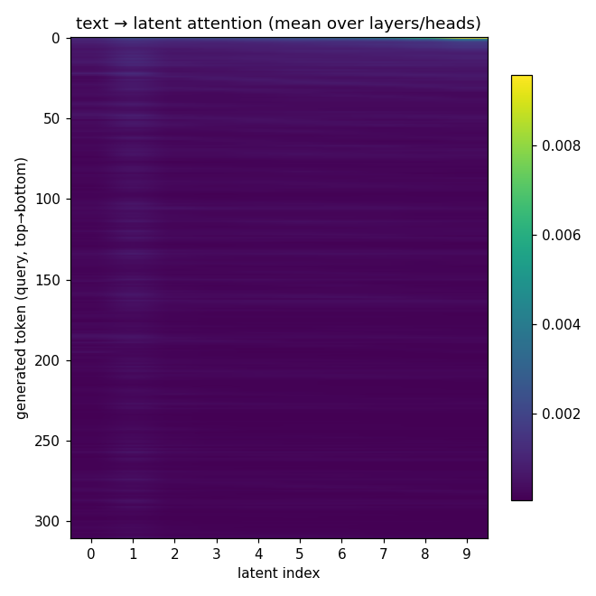
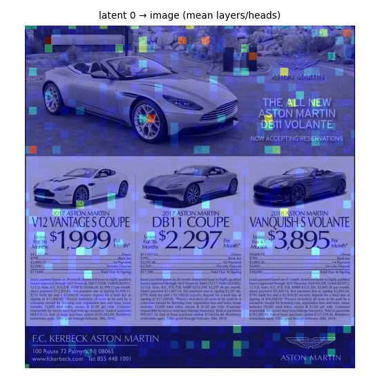
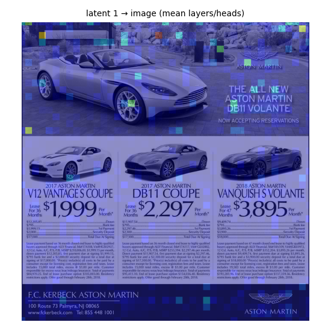
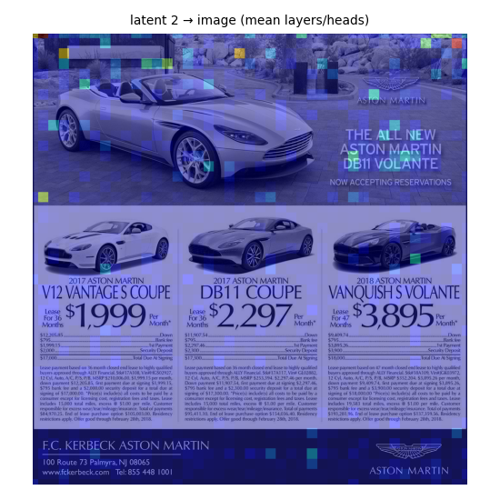
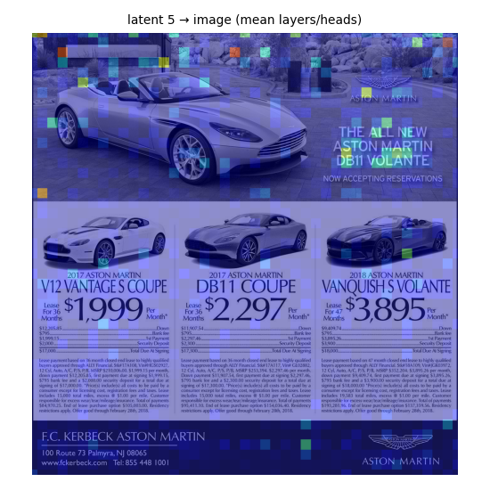
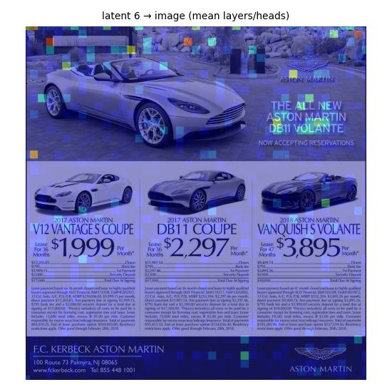
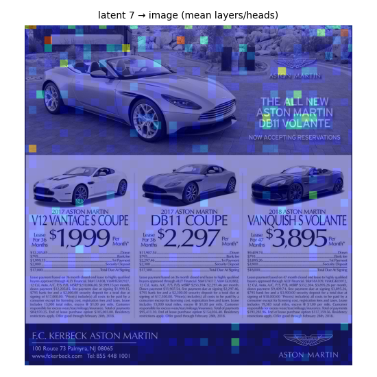
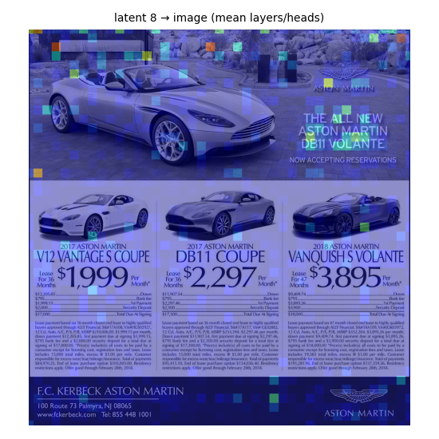
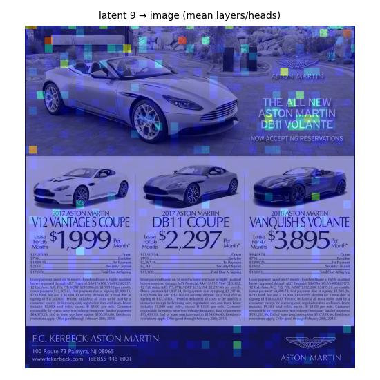

# Monet latent inspection report

- sequence length **2395**, latents **10** in **1** block(s), LATENT_SIZE **10**
- replay==generation gate: **PASS** (min_cos `0.99984`, rel_l2 `0.0180`)

## Generated text

```
To determine which car has the longest rental period, I need to locate the rental duration information for each car model presented in the image. I will focus on the relevant text sections for each car to extract this detail.
<abs_vis_token_pad><abs_vis_token_pad><abs_vis_token_pad><abs_vis_token_pad><abs_vis_token_pad><abs_vis_token_pad><abs_vis_token_pad><abs_vis_token_pad><abs_vis_token_pad><abs_vis_token_pad></abs_vis_token>The zoomed-in image clearly shows the rental period for each car model. The 2017 Aston Martin V12 VANTAGE S COUPE is listed as 36 months, the 2017 Aston Martin DB11 COUPE is also 36 months, the 2018 Aston Martin VANQUISH VOLANTE is 47 months, and the 2018 Aston Martin V12 VOLANTE is 47 months as well. The zoomed-in image confirms the rental period for the 2018 Aston Martin VANQUISH VOLANTE is 47 months.

THOUGHT N: The zoomed-in image clearly shows the rental period for each car model. The 2017 Aston Martin V12 VANTAGE S COUPE is listed as 36 months, the 2017 Aston Martin DB11 COUPE is also 36 months, the 2018 Aston Martin VANQUISH VOLANTE is 47 months, and the 2018 Aston Martin V12 VOLANTE is 47 months as well. The zoomed-in image confirms the rental period for the 2018 Aston Martin VANQUISH VOLANTE is 47 months.

ANSWER: The car with the longest rental period is the 2018 Aston Martin VANQUISH VOLANTE, which is 47 months. The final answer is \boxed{C}.
```

## What each latent represents (final logit lens, top-5)

| latent | top tokens |
|---|---|
| 0 | `<abs_vis_token>` (0.39), `The` (0.22), `For` (0.05), `-` (0.04), `<|im_end|>` (0.04) |
| 1 | `1` (0.28), `A` (0.13), `(` (0.08), `The` (0.04), `L` (0.02) |
| 2 | `1` (0.39), `0` (0.03), `n` (0.03), `To` (0.02), `s` (0.02) |
| 3 | `1` (0.14), `n` (0.07), `rel` (0.03), `cor` (0.03), ` relative` (0.03) |
| 4 | `rel` (0.12), `1` (0.08), `n` (0.08), `cor` (0.02), `t` (0.02) |
| 5 | `rel` (0.09), `n` (0.07), `1` (0.07), `  ` (0.03), `N` (0.02) |
| 6 | `rel` (0.07), `n` (0.06), `1` (0.06), `  ` (0.03), `N` (0.02) |
| 7 | `n` (0.06), `1` (0.05), `rel` (0.05), `  ` (0.03), `N` (0.03) |
| 8 | `1` (0.06), `n` (0.05), `rel` (0.04), `  ` (0.03), `奈` (0.02) |
| 9 | `1` (0.07), `n` (0.04), `rel` (0.04), `  ` (0.03), `奈` (0.02) |

## Objective B — attention summary

**text → latent** (mean attention from generated tokens to each latent, averaged over layers/heads):

| latent | mean text→latent attn |
|---|---|
| 0 | 0.0003 |
| 1 | 0.0004 |
| 2 | 0.0003 |
| 3 | 0.0003 |
| 4 | 0.0003 |
| 5 | 0.0003 |
| 6 | 0.0003 |
| 7 | 0.0003 |
| 8 | 0.0003 |
| 9 | 0.0003 |

See `attn_text2latent.png` and `heatmaps/` for latent→image overlays (full per-layer/head tensors in the `.npz` files).



latent 0: 
latent 1: 
latent 2: 
latent 3: 
latent 4: 
latent 5: 
latent 6: 
latent 7: 
latent 8: 
latent 9: 
