# Monet latent inspection report

- sample **correct_1** (bucket `correct`, dataset index `1880`, category `spatial_relationship`)
- model answer: gold **C** → predicted **C** → **CORRECT** (judge hit=`1`)

- sequence length **372**, latents **10** in **1** block(s), LATENT_SIZE **10**
- replay==generation gate: **PASS** (min_cos `0.99986`, rel_l2 `0.0167`)

## Latent redundancy (how many distinct 'thoughts'?)

- **effective rank (participation ratio) = 1.79** of 10 latents
- variance share of top directions: 72%, 17%, 8%
- pairwise cosine (off-diagonal): mean `0.779`, min `0.256`, max `0.999`

| | L0 | L1 | L2 | L3 | L4 | L5 | L6 | L7 | L8 | L9 |
|---|---|---|---|---|---|---|---|---|---|---|
| **L0** | 1.00 | 0.60 | 0.39 | 0.32 | 0.29 | 0.29 | 0.28 | 0.27 | 0.26 | 0.26 |
| **L1** | 0.60 | 1.00 | 0.78 | 0.68 | 0.65 | 0.64 | 0.64 | 0.63 | 0.63 | 0.62 |
| **L2** | 0.39 | 0.78 | 1.00 | 0.95 | 0.91 | 0.89 | 0.88 | 0.87 | 0.86 | 0.86 |
| **L3** | 0.32 | 0.68 | 0.95 | 1.00 | 0.99 | 0.97 | 0.96 | 0.95 | 0.95 | 0.94 |
| **L4** | 0.29 | 0.65 | 0.91 | 0.99 | 1.00 | 0.99 | 0.99 | 0.98 | 0.98 | 0.97 |
| **L5** | 0.29 | 0.64 | 0.89 | 0.97 | 0.99 | 1.00 | 1.00 | 0.99 | 0.99 | 0.99 |
| **L6** | 0.28 | 0.64 | 0.88 | 0.96 | 0.99 | 1.00 | 1.00 | 1.00 | 1.00 | 0.99 |
| **L7** | 0.27 | 0.63 | 0.87 | 0.95 | 0.98 | 0.99 | 1.00 | 1.00 | 1.00 | 1.00 |
| **L8** | 0.26 | 0.63 | 0.86 | 0.95 | 0.98 | 0.99 | 1.00 | 1.00 | 1.00 | 1.00 |
| **L9** | 0.26 | 0.62 | 0.86 | 0.94 | 0.97 | 0.99 | 0.99 | 1.00 | 1.00 | 1.00 |

## Generated text

```
To determine the direction of New Zealand relative to Australia, I will analyze the map provided.
<abs_vis_token_pad><abs_vis_token_pad><abs_vis_token_pad><abs_vis_token_pad><abs_vis_token_pad><abs_vis_token_pad><abs_vis_token_pad><abs_vis_token_pad><abs_vis_token_pad><abs_vis_token_pad></abs_vis_token>The map clearly shows  New Zealand located to the  southeast of Australia. The labels and relative positions on the map confirm this orientation.Therefore, the final answer is \boxed{C. southeast}.
```

## What each latent represents (final logit lens, top-5)

| latent | top tokens |
|---|---|
| 0 | `<abs_vis_token>` (0.65), `The` (0.14), `<|im_end|>` (0.05), `<tool_call>` (0.03), `From` (0.02) |
| 1 | `1` (0.11), `On` (0.09), `on` (0.05), `The` (0.04), `A` (0.04) |
| 2 | `1` (0.10), `on` (0.03), `n` (0.03), `N` (0.02), `tv` (0.02) |
| 3 | `rel` (0.17), `奈` (0.09), `n` (0.04), `t` (0.03), `1` (0.03) |
| 4 | `rel` (0.30), `奈` (0.12), `n` (0.05), `ase` (0.03), `t` (0.03) |
| 5 | `rel` (0.27), `奈` (0.16), `n` (0.05), `ase` (0.04), `1` (0.03) |
| 6 | `rel` (0.22), `奈` (0.18), `n` (0.06), `ase` (0.04), `1` (0.03) |
| 7 | `rel` (0.20), `奈` (0.18), `n` (0.06), `ase` (0.03), `1` (0.03) |
| 8 | `rel` (0.21), `奈` (0.16), `n` (0.05), `ase` (0.03), `1` (0.03) |
| 9 | `rel` (0.22), `奈` (0.15), `n` (0.03), `1` (0.03), `  ` (0.03) |

## Nearest image patch per latent (cosine, input-embedding space)

Token-decodability-free localiser: the image patch whose embedding is most similar to each latent. Grid position is (row%, col%) of the image.

| latent | top-1 cosine | grid (row%, col%) | top-3 patches (row%,col%) |
|---|---|---|---|
| 0 | 0.027 | (8%, 28%) | (8%,28%), (8%,22%), (17%,17%) |
| 1 | 0.088 | (0%, 94%) | (0%,94%), (0%,83%), (33%,17%) |
| 2 | 0.069 | (0%, 83%) | (0%,83%), (0%,94%), (33%,17%) |
| 3 | 0.055 | (67%, 67%) | (67%,67%), (58%,44%), (75%,33%) |
| 4 | 0.056 | (58%, 44%) | (58%,44%), (67%,67%), (42%,56%) |
| 5 | 0.055 | (67%, 67%) | (67%,67%), (58%,44%), (42%,56%) |
| 6 | 0.055 | (67%, 67%) | (67%,67%), (92%,39%), (75%,33%) |
| 7 | 0.054 | (67%, 67%) | (67%,67%), (75%,33%), (92%,39%) |
| 8 | 0.054 | (75%, 33%) | (75%,33%), (67%,67%), (92%,39%) |
| 9 | 0.054 | (75%, 33%) | (75%,33%), (92%,39%), (67%,67%) |

See `heatmaps/latent{i}_nearest.png` for the cosine map overlaid on the image.

## Objective B.1 — text → latent (readout)

Strongest reader (max over layers/heads) of the latent block, by generated token. Uniform baseline for the 10-token block ≈ `0.0269`.

| query token | offset after block | max latent-block attn |
|---|---|---|
| pos 331 | +0 | 0.937 |
| pos 332 | +1 | 0.826 |
| pos 333 | +2 | 0.779 |
| pos 334 | +3 | 0.662 |
| pos 335 | +4 | 0.637 |
| pos 336 | +5 | 0.615 |

## Objective B.2 — latent → image

- mean attention mass each latent places on the image: **0.049**
- spatial overlays (sink-suppressed) in `heatmaps/latent{i}_overlay.png`; full `[L,H,N_lat,N_img]` tensor in `attn_latent2image.npz`.

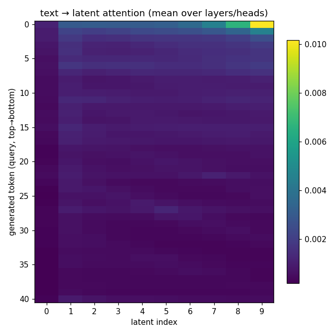

latent 0: 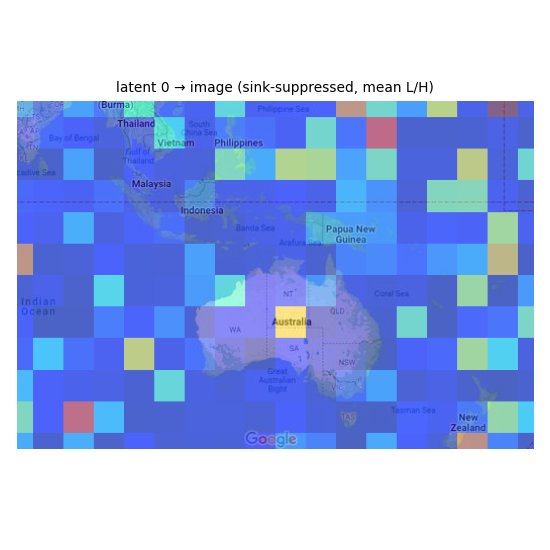 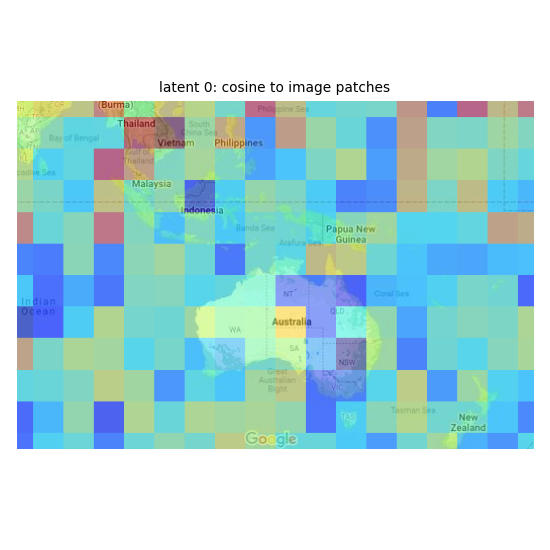
latent 1: 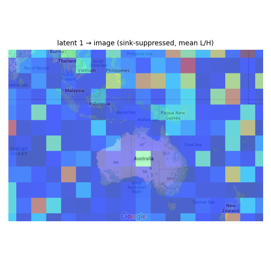 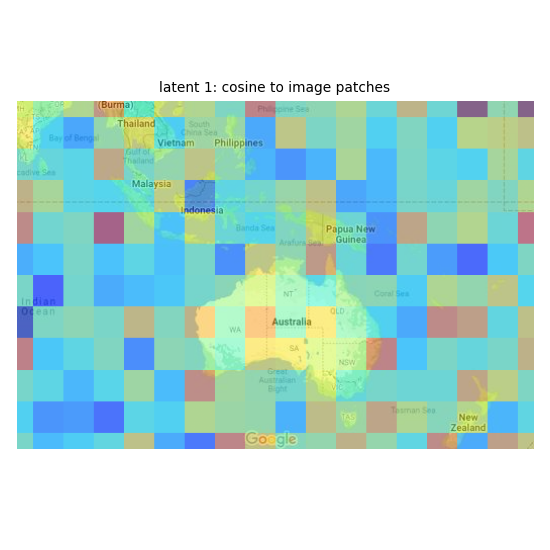
latent 2: 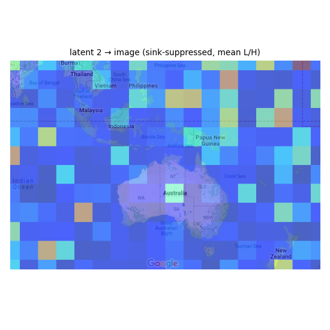 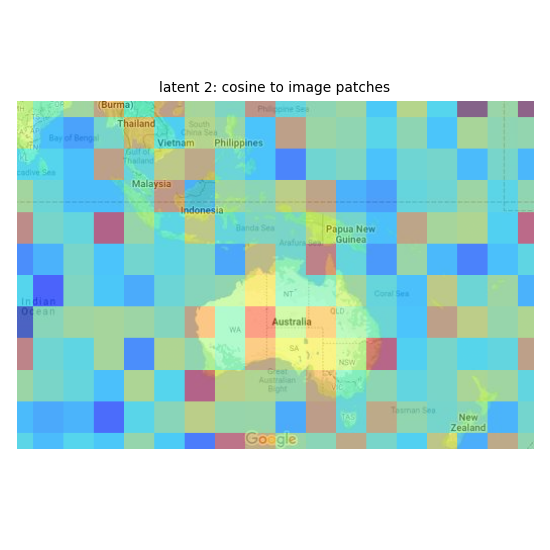
latent 3:  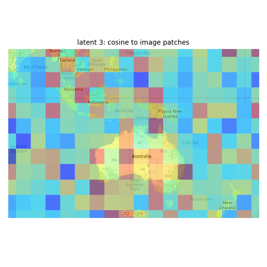
latent 4: 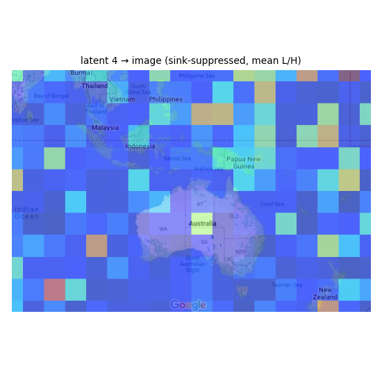 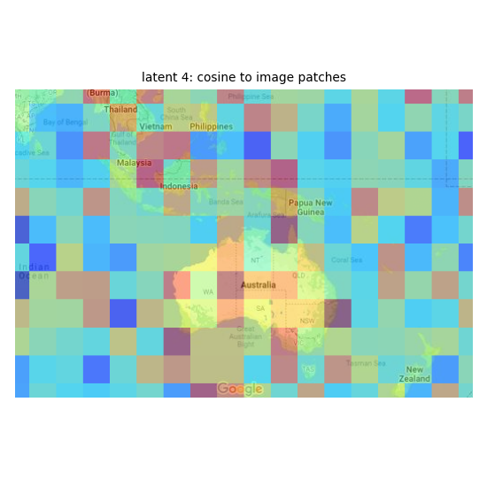
latent 5:  
latent 6:  
latent 7:  
latent 8: 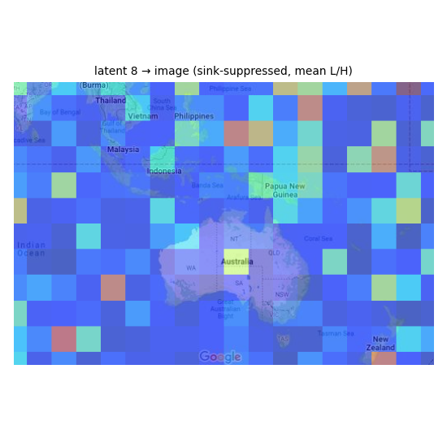 
latent 9:  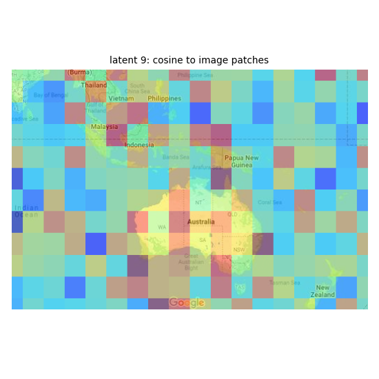
