# Monet latent inspection report

- sample **incorrect_0** (bucket `incorrect`, dataset index `662`, category `object_localization`)
- model answer: gold **C** → predicted **A** → **INCORRECT** (judge hit=`1`)

- sequence length **417**, latents **10** in **1** block(s), LATENT_SIZE **10**
- replay==generation gate: **PASS** (min_cos `0.99983`, rel_l2 `0.0186`)

## Latent redundancy (how many distinct 'thoughts'?)

- **effective rank (participation ratio) = 1.77** of 10 latents
- variance share of top directions: 73%, 17%, 7%
- pairwise cosine (off-diagonal): mean `0.768`, min `0.248`, max `0.999`

| | L0 | L1 | L2 | L3 | L4 | L5 | L6 | L7 | L8 | L9 |
|---|---|---|---|---|---|---|---|---|---|---|
| **L0** | 1.00 | 0.63 | 0.37 | 0.30 | 0.27 | 0.26 | 0.26 | 0.26 | 0.25 | 0.25 |
| **L1** | 0.63 | 1.00 | 0.77 | 0.66 | 0.63 | 0.62 | 0.61 | 0.60 | 0.60 | 0.59 |
| **L2** | 0.37 | 0.77 | 1.00 | 0.94 | 0.88 | 0.86 | 0.85 | 0.85 | 0.84 | 0.83 |
| **L3** | 0.30 | 0.66 | 0.94 | 1.00 | 0.98 | 0.96 | 0.95 | 0.94 | 0.94 | 0.93 |
| **L4** | 0.27 | 0.63 | 0.88 | 0.98 | 1.00 | 0.99 | 0.99 | 0.98 | 0.97 | 0.97 |
| **L5** | 0.26 | 0.62 | 0.86 | 0.96 | 0.99 | 1.00 | 1.00 | 0.99 | 0.99 | 0.98 |
| **L6** | 0.26 | 0.61 | 0.85 | 0.95 | 0.99 | 1.00 | 1.00 | 1.00 | 1.00 | 0.99 |
| **L7** | 0.26 | 0.60 | 0.85 | 0.94 | 0.98 | 0.99 | 1.00 | 1.00 | 1.00 | 1.00 |
| **L8** | 0.25 | 0.60 | 0.84 | 0.94 | 0.97 | 0.99 | 1.00 | 1.00 | 1.00 | 1.00 |
| **L9** | 0.25 | 0.59 | 0.83 | 0.93 | 0.97 | 0.98 | 0.99 | 1.00 | 1.00 | 1.00 |

## Generated text

```
The task is to identify the number of TV remote controls present in the image. I will examine the image to count the remote controls.
<abs_vis_token_pad><abs_vis_token_pad><abs_vis_token_pad><abs_vis_token_pad><abs_vis_token_pad><abs_vis_token_pad><abs_vis_token_pad><abs_vis_token_pad><abs_vis_token_pad><abs_vis_token_pad></abs_vis_token>The image clearly shows  two distinct TV remote controls. One is  black and the other is  white, both resting on a surface.Therefore, the final answer is \boxed{C}.
```

## What each latent represents (final logit lens, top-5)

| latent | top tokens |
|---|---|
| 0 | `<abs_vis_token>` (0.64), `Upon` (0.06), `The` (0.06), `<tool_call>` (0.03), `<|im_end|>` (0.02) |
| 1 | `1` (0.08), `On` (0.07), `The` (0.06), `A` (0.06), `There` (0.04) |
| 2 | `1` (0.12), `On` (0.03), `0` (0.03), `o` (0.02), `s` (0.02) |
| 3 | `rel` (0.18), `1` (0.06), `n` (0.04), `奈` (0.03), ` relative` (0.02) |
| 4 | `rel` (0.38), `1` (0.07), `n` (0.03), `奈` (0.02), `t` (0.02) |
| 5 | `rel` (0.30), `1` (0.06), `奈` (0.03), `n` (0.03), `t` (0.02) |
| 6 | `rel` (0.23), `1` (0.05), `奈` (0.05), `n` (0.04), `To` (0.02) |
| 7 | `rel` (0.17), `奈` (0.05), `1` (0.04), `n` (0.04), `  ` (0.02) |
| 8 | `rel` (0.14), `奈` (0.05), `1` (0.05), `n` (0.04), `  ` (0.02) |
| 9 | `rel` (0.11), `奈` (0.06), `1` (0.05), `n` (0.03), `  ` (0.02) |

## Nearest image patch per latent (cosine, input-embedding space)

Token-decodability-free localiser: the image patch whose embedding is most similar to each latent. Grid position is (row%, col%) of the image.

| latent | top-1 cosine | grid (row%, col%) | top-3 patches (row%,col%) |
|---|---|---|---|
| 0 | 0.033 | (29%, 33%) | (29%,33%), (14%,50%), (0%,6%) |
| 1 | 0.083 | (0%, 61%) | (0%,61%), (64%,94%), (0%,94%) |
| 2 | 0.070 | (0%, 6%) | (0%,6%), (64%,94%), (7%,22%) |
| 3 | 0.060 | (0%, 6%) | (0%,6%), (64%,94%), (29%,39%) |
| 4 | 0.061 | (64%, 94%) | (64%,94%), (57%,50%), (79%,56%) |
| 5 | 0.063 | (64%, 94%) | (64%,94%), (57%,50%), (29%,44%) |
| 6 | 0.061 | (64%, 94%) | (64%,94%), (57%,50%), (29%,44%) |
| 7 | 0.059 | (64%, 94%) | (64%,94%), (57%,50%), (0%,61%) |
| 8 | 0.058 | (64%, 94%) | (64%,94%), (57%,50%), (0%,61%) |
| 9 | 0.056 | (64%, 94%) | (64%,94%), (57%,50%), (0%,61%) |

See `heatmaps/latent{i}_nearest.png` for the cosine map overlaid on the image.

## Objective B.1 — text → latent (readout)

Strongest reader (max over layers/heads) of the latent block, by generated token. Uniform baseline for the 10-token block ≈ `0.0240`.

| query token | offset after block | max latent-block attn |
|---|---|---|
| pos 377 | +0 | 0.930 |
| pos 378 | +1 | 0.830 |
| pos 379 | +2 | 0.802 |
| pos 381 | +4 | 0.656 |
| pos 380 | +3 | 0.636 |
| pos 382 | +5 | 0.617 |

## Objective B.2 — latent → image

- mean attention mass each latent places on the image: **0.051**
- spatial overlays (sink-suppressed) in `heatmaps/latent{i}_overlay.png`; full `[L,H,N_lat,N_img]` tensor in `attn_latent2image.npz`.

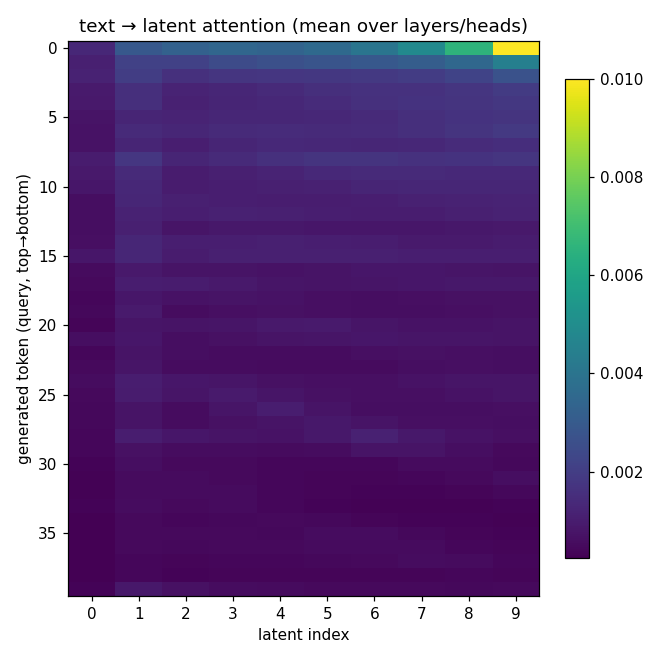

latent 0: 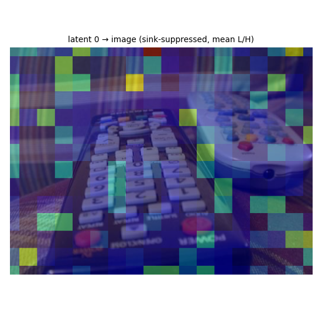 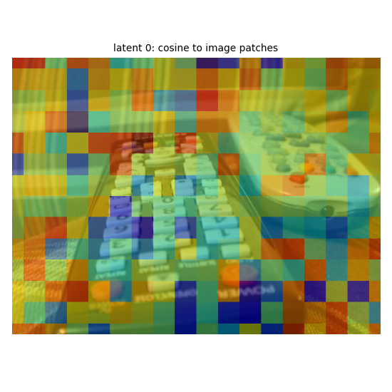
latent 1: 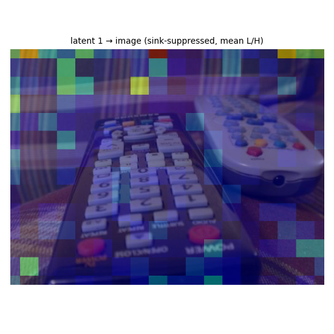 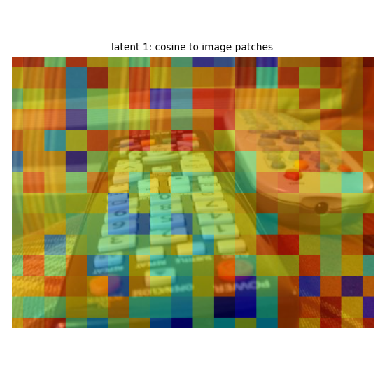
latent 2: 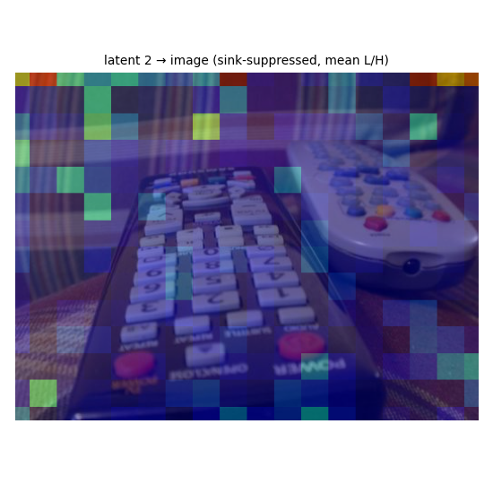 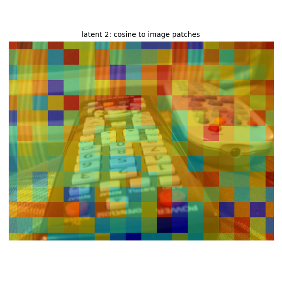
latent 3: 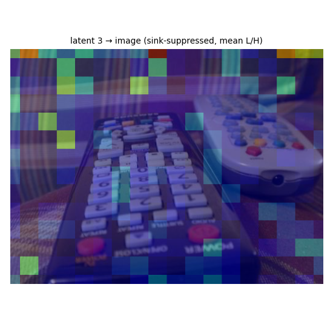 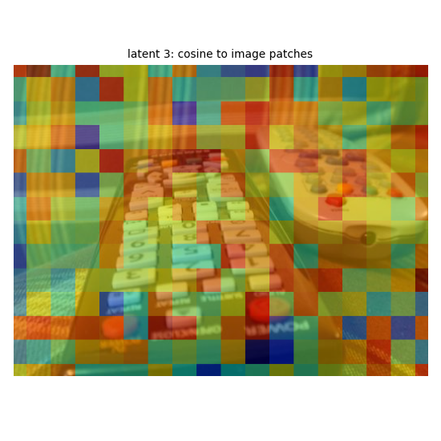
latent 4:  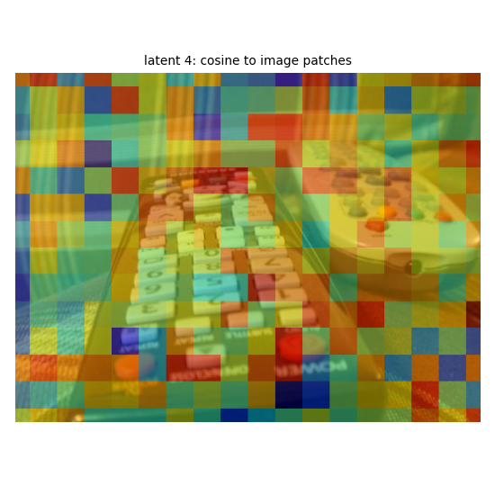
latent 5: 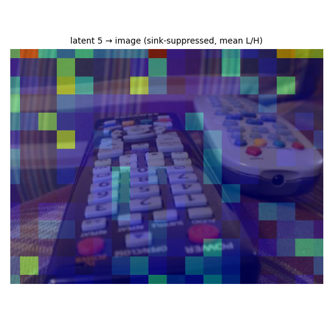 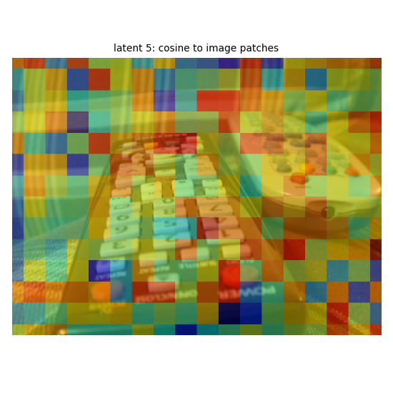
latent 6: 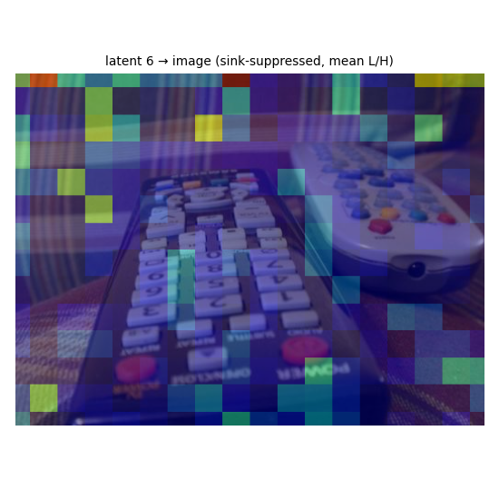 
latent 7: 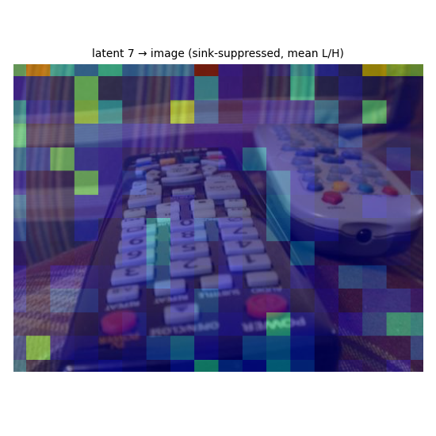 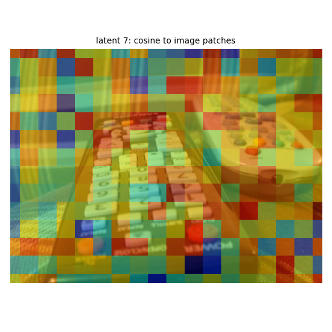
latent 8: 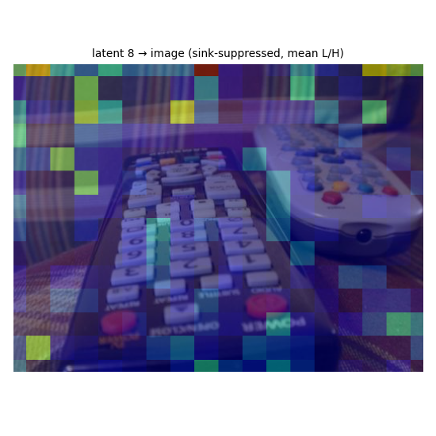 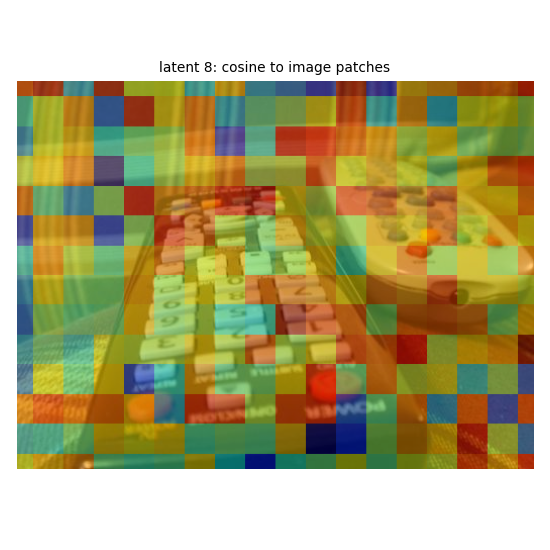
latent 9: 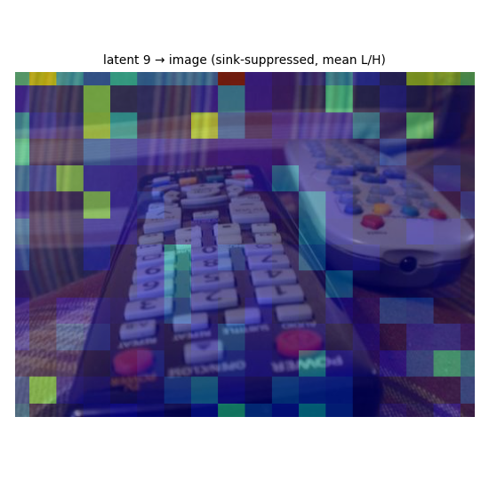 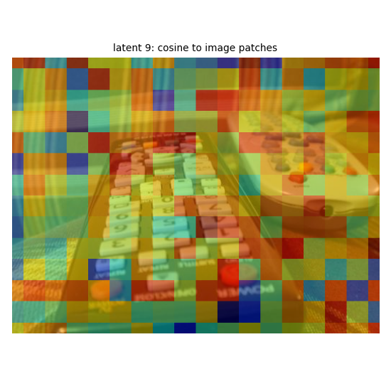
