# Monet latent inspection report

- sample **incorrect_1** (bucket `incorrect`, dataset index `656`, category `object_localization`)
- model answer: gold **A** → predicted **C** → **INCORRECT** (judge hit=`0`)

- sequence length **424**, latents **10** in **1** block(s), LATENT_SIZE **10**
- replay==generation gate: **PASS** (min_cos `0.99974`, rel_l2 `0.0229`)

## Latent redundancy (how many distinct 'thoughts'?)

- **effective rank (participation ratio) = 1.74** of 10 latents
- variance share of top directions: 74%, 16%, 7%
- pairwise cosine (off-diagonal): mean `0.768`, min `0.220`, max `0.999`

| | L0 | L1 | L2 | L3 | L4 | L5 | L6 | L7 | L8 | L9 |
|---|---|---|---|---|---|---|---|---|---|---|
| **L0** | 1.00 | 0.60 | 0.33 | 0.28 | 0.25 | 0.23 | 0.23 | 0.23 | 0.23 | 0.22 |
| **L1** | 0.60 | 1.00 | 0.76 | 0.67 | 0.64 | 0.63 | 0.62 | 0.62 | 0.62 | 0.61 |
| **L2** | 0.33 | 0.76 | 1.00 | 0.95 | 0.90 | 0.89 | 0.88 | 0.87 | 0.86 | 0.86 |
| **L3** | 0.28 | 0.67 | 0.95 | 1.00 | 0.98 | 0.97 | 0.96 | 0.95 | 0.94 | 0.94 |
| **L4** | 0.25 | 0.64 | 0.90 | 0.98 | 1.00 | 0.99 | 0.99 | 0.98 | 0.97 | 0.97 |
| **L5** | 0.23 | 0.63 | 0.89 | 0.97 | 0.99 | 1.00 | 1.00 | 0.99 | 0.99 | 0.98 |
| **L6** | 0.23 | 0.62 | 0.88 | 0.96 | 0.99 | 1.00 | 1.00 | 1.00 | 1.00 | 0.99 |
| **L7** | 0.23 | 0.62 | 0.87 | 0.95 | 0.98 | 0.99 | 1.00 | 1.00 | 1.00 | 1.00 |
| **L8** | 0.23 | 0.62 | 0.86 | 0.94 | 0.97 | 0.99 | 1.00 | 1.00 | 1.00 | 1.00 |
| **L9** | 0.22 | 0.61 | 0.86 | 0.94 | 0.97 | 0.98 | 0.99 | 1.00 | 1.00 | 1.00 |

## Generated text

```
To determine the man's direction, I will analyze the provided image to identify the man wearing the hat and his gaze.
<abs_vis_token_pad><abs_vis_token_pad><abs_vis_token_pad><abs_vis_token_pad><abs_vis_token_pad><abs_vis_token_pad><abs_vis_token_pad><abs_vis_token_pad><abs_vis_token_pad><abs_vis_token_pad></abs_vis_token>The man is  positioned  behind the young boy, and his head is  turned to look over his shoulder, indicating he is  facing the camera.
THOUGHT N: The man is  facing the camera, as his head is  turned to look over his shoulder.Therefore, the final answer is \boxed{C. facing the camera}.
```

## What each latent represents (final logit lens, top-5)

| latent | top tokens |
|---|---|
| 0 | `<abs_vis_token>` (0.79), `The` (0.07), `<tool_call>` (0.02), `Upon` (0.01), `<|im_end|>` (0.01) |
| 1 | `1` (0.24), `A` (0.12), `ANS` (0.07), `On` (0.04), `The` (0.03) |
| 2 | `1` (0.17), `To` (0.04), `A` (0.03), `n` (0.03), `to` (0.02) |
| 3 | `1` (0.10), `rel` (0.06), ` relative` (0.06), `n` (0.06), `t` (0.03) |
| 4 | `rel` (0.13), `1` (0.12), `n` (0.08), `t` (0.04), ` relative` (0.03) |
| 5 | `1` (0.13), `n` (0.10), `rel` (0.09), `t` (0.03), `  ` (0.02) |
| 6 | `n` (0.13), `1` (0.11), `rel` (0.07), `t` (0.03), `  ` (0.03) |
| 7 | `n` (0.15), `1` (0.10), `rel` (0.05), `  ` (0.03), `t` (0.02) |
| 8 | `n` (0.14), `1` (0.09), `rel` (0.05), `  ` (0.03), `t` (0.02) |
| 9 | `n` (0.11), `1` (0.09), `rel` (0.05), `  ` (0.04), `t` (0.01) |

## Nearest image patch per latent (cosine, input-embedding space)

Token-decodability-free localiser: the image patch whose embedding is most similar to each latent. Grid position is (row%, col%) of the image.

| latent | top-1 cosine | grid (row%, col%) | top-3 patches (row%,col%) |
|---|---|---|---|
| 0 | 0.039 | (72%, 58%) | (72%,58%), (50%,25%), (89%,92%) |
| 1 | 0.079 | (0%, 25%) | (0%,25%), (0%,0%), (0%,8%) |
| 2 | 0.066 | (0%, 25%) | (0%,25%), (0%,8%), (6%,58%) |
| 3 | 0.064 | (50%, 67%) | (50%,67%), (0%,25%), (50%,50%) |
| 4 | 0.070 | (50%, 67%) | (50%,67%), (50%,50%), (61%,75%) |
| 5 | 0.073 | (50%, 67%) | (50%,67%), (50%,50%), (61%,75%) |
| 6 | 0.074 | (50%, 67%) | (50%,67%), (50%,50%), (56%,50%) |
| 7 | 0.074 | (50%, 67%) | (50%,67%), (50%,50%), (0%,25%) |
| 8 | 0.075 | (50%, 67%) | (50%,67%), (50%,50%), (0%,25%) |
| 9 | 0.075 | (50%, 67%) | (50%,67%), (50%,50%), (0%,25%) |

See `heatmaps/latent{i}_nearest.png` for the cosine map overlaid on the image.

## Objective B.1 — text → latent (readout)

Strongest reader (max over layers/heads) of the latent block, by generated token. Uniform baseline for the 10-token block ≈ `0.0236`.

| query token | offset after block | max latent-block attn |
|---|---|---|
| pos 352 | +0 | 0.930 |
| pos 353 | +1 | 0.818 |
| pos 354 | +2 | 0.781 |
| pos 355 | +3 | 0.667 |
| pos 356 | +4 | 0.642 |
| pos 357 | +5 | 0.611 |

## Objective B.2 — latent → image

- mean attention mass each latent places on the image: **0.055**
- spatial overlays (sink-suppressed) in `heatmaps/latent{i}_overlay.png`; full `[L,H,N_lat,N_img]` tensor in `attn_latent2image.npz`.

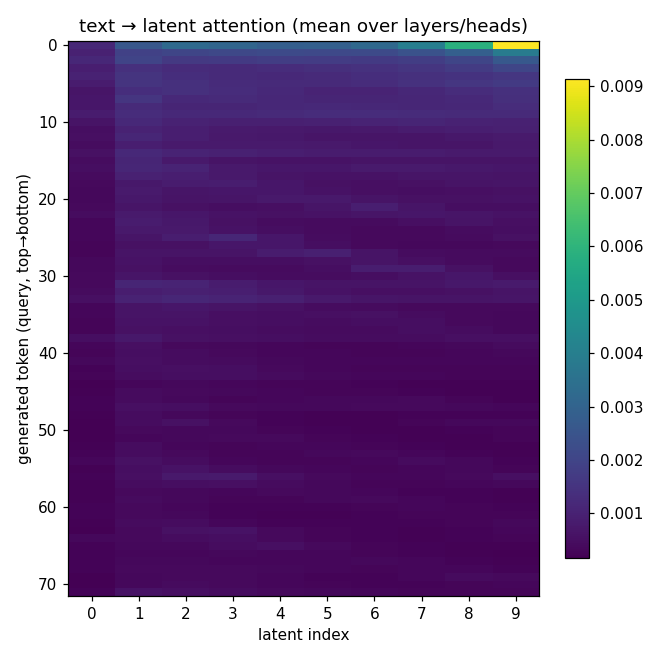

latent 0: 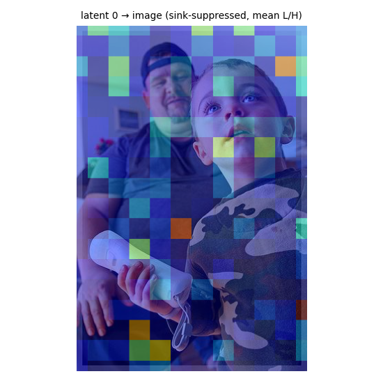 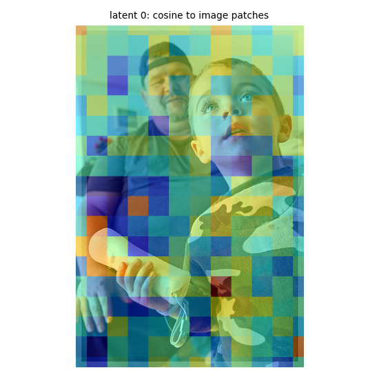
latent 1: 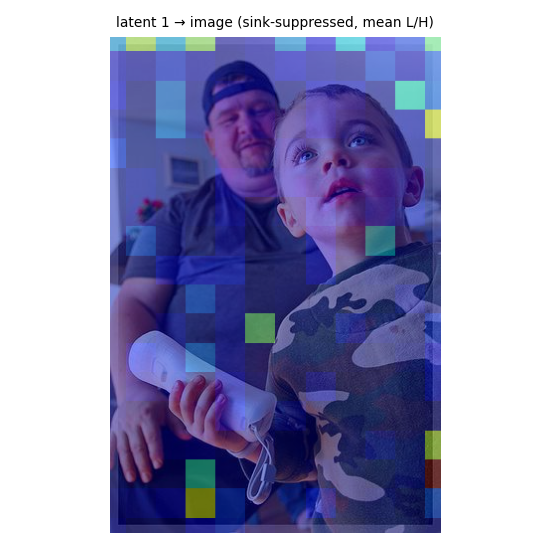 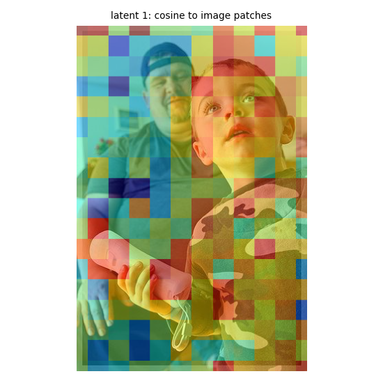
latent 2: 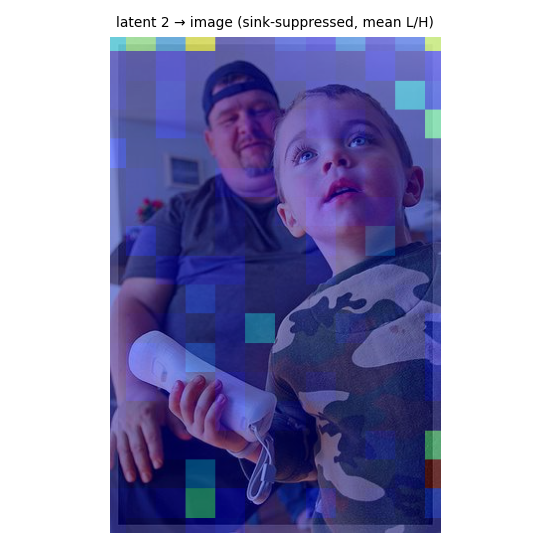 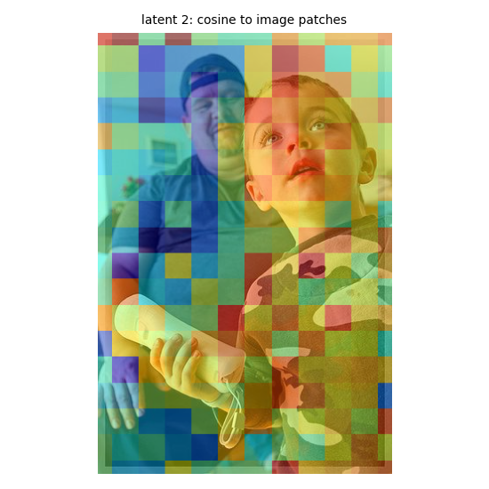
latent 3: 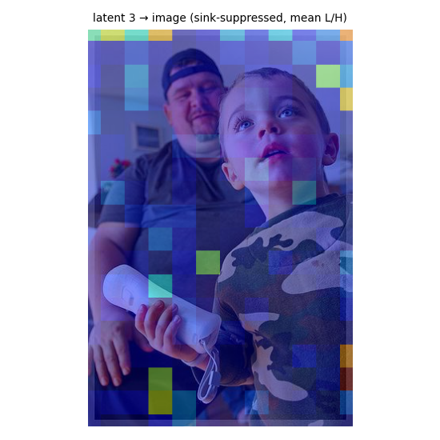 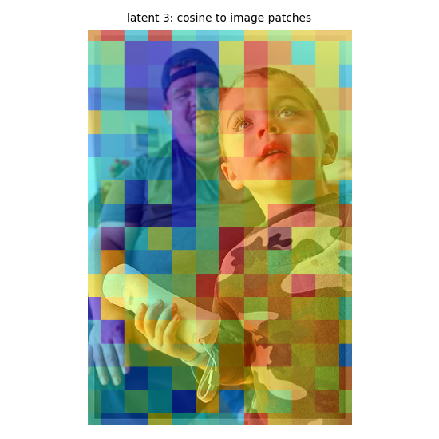
latent 4: 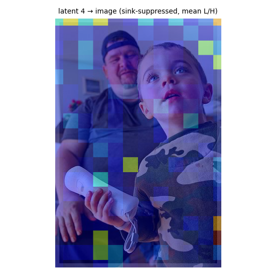 
latent 5:  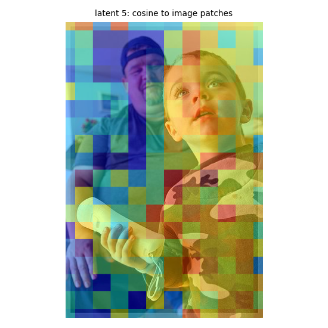
latent 6: 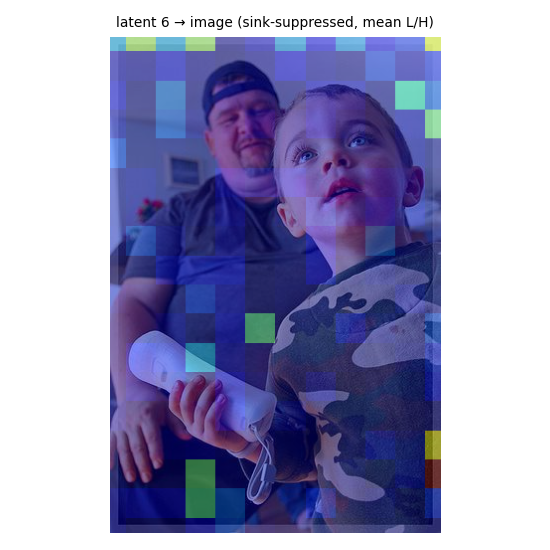 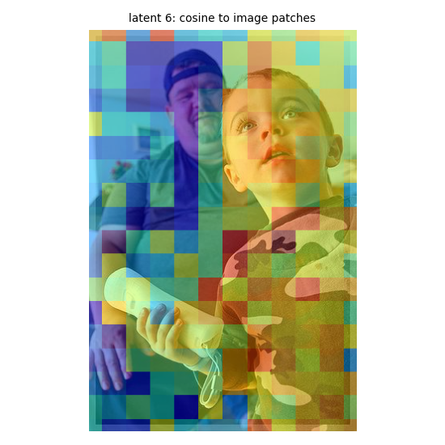
latent 7:  
latent 8:  
latent 9: 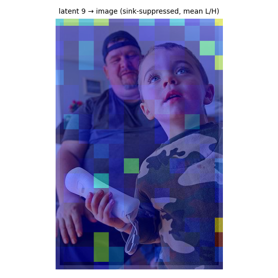 
